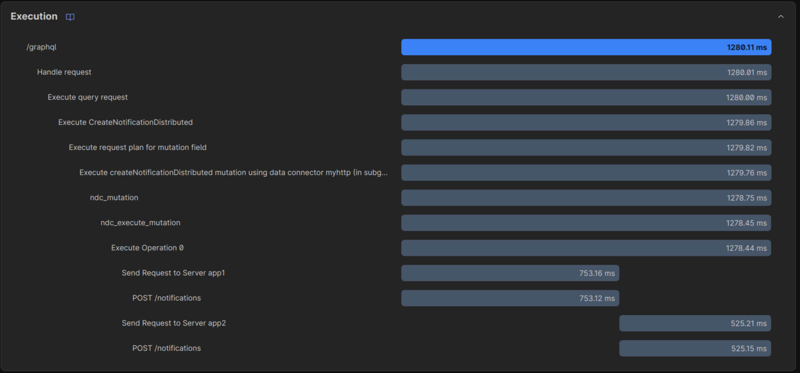
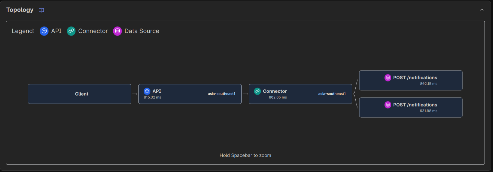
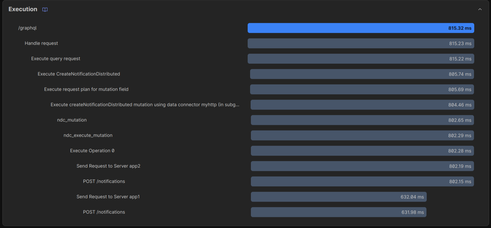

# Fan-in & fan-out patterns example with DDN, HTTP connector and OneSignal

Fan-in and fan-out patterns are commonly used in the microservices world to improve concurrency and optimize processing time by dividing a task into multiple sub-tasks that can be processed in parallel (fan-out) and then combining the results of these sub-tasks into a single outcome (fan-in). In this demo I will illutrate how to use these patterns with Hasura DDN, HTTP connector to solve OneSignal's use cases.

## Use case

OneSignal is a populaar customer engagement solution for push notifications, email, SMS, in-app messaging, and Live Activities. Due to security reasons each application allows only one origin (host) or mobile app ID. Developers must set up multiple OneSignal apps for each origin if they have multiple sites and mobile apps. When broadcasting notification to all platforms they need to send the same REST request to each OneSignal app with different App ID and API key (fan-out). Hasura DDN and HTTP connector can helps us solve this use case easily.

## Get Started

### Configure OneSignal

Create an OneSignal account and 2 applications. Enable [Web platform](https://documentation.onesignal.com/docs/web-sdk-setup#configure-your-onesignal-app-and-platform), set localhost origins for each application and enable Local Testing:

- http://localhost:3000
- http://localhost:3001

Navigates to [Settings > Keys & IDs](https://documentation.onesignal.com/docs/keys-and-ids) to get App ID and App Key for each application.

### Configure DDN project.

Follow the [Quickstart with Hasura DDN](https://hasura.io/docs/3.0/quickstart) section in the Hasura docs. In the `Connect to data` step, choose `hasura/http` connector. The default connector name is `myhttp` and in the `app` subgraph.

Edit the [app/connector/myhttp/config.yaml](./app/connector/myhttp/config.yaml) to import the OneSignal schema in the `files` array:

```yaml
files:
  - file: https://raw.githubusercontent.com/hasura/ndc-http-recipes/refs/heads/main/recipes/onesignal/schema/onesignal_v1.json
    spec: ndc
    distributed: true
    patchAfter:
      - path: patch-after.json
        strategy: merge
```

Add a JSON path file [patch-after.json](./app/connector/myhttp/patch-after.json) to configure servers and credentials for OneSignal apps. Each server element is configured with different App ID and App Key token.

```json
{
  "$schema": "https://raw.githubusercontent.com/hasura/ndc-http/refs/heads/main/ndc-http-schema/jsonschema/ndc-http-schema.schema.json",
  "settings": {
    "servers": [
      {
        "id": "app1",
        "url": {
          "value": "https://onesignal.com/api/v1",
          "env": "ONESIGNAL_SERVER_URL"
        },
        "argumentPresets": [
          {
            "path": "app_id",
            "value": { "type": "env", "name": "ONESIGNAL_APP_ID" },
            "targets": []
          },
          {
            "path": "body.app_id",
            "value": { "type": "env", "name": "ONESIGNAL_APP_ID" },
            "targets": []
          }
        ],
        "securitySchemes": {
          "app_key": {
            "type": "http",
            "header": "Authorization",
            "scheme": "bearer",
            "value": { "env": "ONESIGNAL_APP_KEY_TOKEN" }
          }
        }
      },
      {
        "id": "app2",
        "url": {
          "value": "https://onesignal.com/api/v1",
          "env": "ONESIGNAL_SERVER_URL"
        },
        "argumentPresets": [
          {
            "path": "app_id",
            "value": { "type": "env", "name": "ONESIGNAL_APP_ID_2" },
            "targets": []
          },
          {
            "path": "body.app_id",
            "value": { "type": "env", "name": "ONESIGNAL_APP_ID_2" },
            "targets": []
          }
        ],
        "securitySchemes": {
          "app_key": {
            "type": "http",
            "header": "Authorization",
            "scheme": "bearer",
            "value": { "env": "ONESIGNAL_APP_KEY_TOKEN_2" }
          }
        }
      }
    ]
  }
}
```

`argumentPresets` settings inject pre-defined values into request arguments. It's similar to [the argument preset of Hasura DDN](https://hasura.io/docs/3.0/supergraph-modeling/data-connector-links/#dataconnectorlink-dataconnectorargumentpreset). However, this setting in the HTTP connector supports environment variables and each server can configure different present arguments that is more flexible.

`distributed: true` must be set to enable distributed operations. You will see duplicated queries and mutations with the `Distributed` prefix. The connector will send requests to all remote servers when calling those operations.

Introspect the connector schema. The connector will print some warning to guide you to add new environment variables to the project metadata.

```sh
ddn connector introspect myhttp
```

```
Environment Variables:
  Make sure that the following environment variables were added to your subgraph configuration:

  --- app/connector/myhttp/docker.yaml
  services:
    app_myhttp:
      environment:
        ONESIGNAL_APP_ID: $APP_MYHTTP_ONESIGNAL_APP_ID
        ONESIGNAL_APP_ID_2: $APP_MYHTTP_ONESIGNAL_APP_ID_2
        ONESIGNAL_APP_KEY_TOKEN: $APP_MYHTTP_ONESIGNAL_APP_KEY_TOKEN
        ONESIGNAL_APP_KEY_TOKEN_2: $APP_MYHTTP_ONESIGNAL_APP_KEY_TOKEN_2
        # ...
  ---

  --- app/connector/myhttp/connector.yaml
  envMapping:
    ONESIGNAL_APP_ID:
      fromEnv: APP_MYHTTP_ONESIGNAL_APP_ID
    ONESIGNAL_APP_ID_2:
      fromEnv: APP_MYHTTP_ONESIGNAL_APP_ID_2
    ONESIGNAL_APP_KEY_TOKEN:
      fromEnv: APP_MYHTTP_ONESIGNAL_APP_KEY_TOKEN
    ONESIGNAL_APP_KEY_TOKEN_2:
      fromEnv: APP_MYHTTP_ONESIGNAL_APP_KEY_TOKEN_2
    # ...
  ---

  --- .env
  APP_MYHTTP_ONESIGNAL_APP_ID=
  APP_MYHTTP_ONESIGNAL_APP_ID_2=
  APP_MYHTTP_ONESIGNAL_APP_KEY_TOKEN=
  APP_MYHTTP_ONESIGNAL_APP_KEY_TOKEN_2=
  # ...
  ---
```

Values of those variables are retrieved from the [Configure OneSignal](#configure-onesignal) step. After adding those variables, continue to add commmands, build and start the supergraph locally.

```sh
ddn command add myhttp "*"
ddn supergraph build local
ddn run docker-start
```

Open a new terminal tab, open the local console.

```sh
ddn console --local
```

Before sending notifications, open 2 browser tabs for demo frontend apps and subscribe first to receive notifications later.

- http://localhost:3000
- http://localhost:3001

### Push notification (fan-out)

Execute the `createNotificationDistributed` mutation in the Graphiql playground:

```gql
mutation CreateNotificationDistributed {
  createNotificationDistributed(
    body: {
      headings: { en: "Hello" }
      contents: { en: "Hello world" }
      includedSegments: ["Subscribed Users"]
    } # httpOptions: { parallel: true }
  ) {
    results {
      server
      data {
        id
        externalId
        errors
        recipients
      }
    }
    errors {
      details
      message
      server
    }
  }
}
```




The mutation supports sequence or parallel execution. By default, requests are executed in sequence. You need to add `httpOptions: { parallel: true }` to enable parallel execution.



### List notifications (fan-in)

```gql
query GetNotifications {
  getNotificationsDistributed(limit: 3) {
    results {
      server
      data {
        notifications {
          id
          headings {
            en
          }
          contents {
            en
          }
          aggregation
          failed
          errored
          successful
        }
        totalCount
      }
    }
    errors {
      details
      message
      server
    }
  }
}
```

```json
{
  "data": {
    "getNotificationsDistributed": {
      "results": [
        {
          "server": "app2",
          "data": {
            "notifications": [
              {
                "id": "f5c3068c-542e-49a4-ab3e-2949f032a30c",
                "headings": {
                  "en": "Hello"
                },
                "contents": {
                  "en": "Hello world"
                },
                "aggregation": null,
                "failed": 0,
                "errored": 1,
                "successful": 1
              },
              {
                "id": "8d1b62c5-abac-4d30-ab12-8a145e9d0ff2",
                "headings": {
                  "en": "Hello"
                },
                "contents": {
                  "en": "Hello world"
                },
                "aggregation": null,
                "failed": 0,
                "errored": 1,
                "successful": 1
              },
              {
                "id": "9e04a254-dbbc-4d50-88c2-1922cf85fc3b",
                "headings": {
                  "en": "Hello"
                },
                "contents": {
                  "en": "Hello world"
                },
                "aggregation": null,
                "failed": 0,
                "errored": 1,
                "successful": 1
              }
            ],
            "totalCount": 33
          }
        },
        {
          "server": "app1",
          "data": {
            "notifications": [
              {
                "id": "b4f04ad9-a100-470d-89ed-6474747fbc7c",
                "headings": {
                  "en": "Hello"
                },
                "contents": {
                  "en": "Hello world"
                },
                "aggregation": null,
                "failed": 0,
                "errored": 6,
                "successful": 1
              },
              {
                "id": "ac122cd4-0ee8-4192-907b-d3fefce468db",
                "headings": {
                  "en": "Hello"
                },
                "contents": {
                  "en": "Hello world"
                },
                "aggregation": null,
                "failed": 0,
                "errored": 6,
                "successful": 1
              },
              {
                "id": "bd4c7362-e39d-4b84-9ea6-64d3f6b533e6",
                "headings": {
                  "en": "Hello"
                },
                "contents": {
                  "en": "Hello world"
                },
                "aggregation": null,
                "failed": 0,
                "errored": 6,
                "successful": 1
              }
            ],
            "totalCount": 32
          }
        }
      ],
      "errors": []
    }
  }
}
```

The response contains results and errors groups by executed servers. You need to check and merge results.
